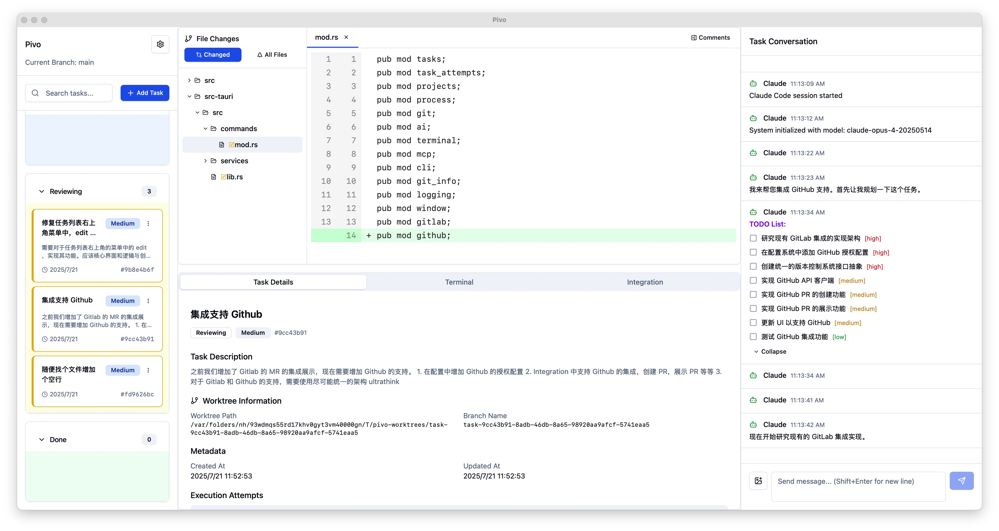

# Pivo - Task-focused programming environment designed for the right vibe


[English](README.md) | [中文](README-zh.md)

> **Task-focused programming environment designed for the right vibe.**

**Pivo** is built with Tauri, React, and Rust, providing a seamless experience for managing Git-based projects with integrated AI assistance and terminal capabilities.


*Main interface showing task management, file changes, and AI conversation features*

## ✨ Key Features

### 🎯 Project Management
- **Git Integration**: Native Git repository support with automatic project detection
- **Multi-Project Workspace**: Manage multiple projects simultaneously
- **Branch Management**: Advanced Git worktree support for task isolation

### 📋 Task Management
- **Kanban Board**: Visual task management with drag-and-drop functionality
- **Task Hierarchy**: Support for parent-child task relationships
- **Status Tracking**: Comprehensive task status and priority management
- **Task Attempts**: Isolated execution environments for each task attempt

### 🤖 AI Integration
- **Claude Assistant**: Integrated Claude AI for intelligent task assistance
- **Gemini Support**: Alternative AI model support for diverse workflows
- **Conversation History**: Persistent AI conversation tracking per task
- **Context-Aware**: AI understands project structure and task context

### 🖥️ Terminal Integration
- **Embedded Terminal**: Built-in terminal with xterm.js
- **Process Management**: Track and manage running processes
- **Command History**: Persistent command execution history
- **Multi-Session**: Support for multiple terminal sessions

### 🔧 Advanced Features
- **MCP Server Support**: Model Control Protocol for extensible AI capabilities
- **File Watching**: Real-time file system monitoring
- **Diff Viewer**: Built-in code diff visualization
- **Merge Request Integration**: GitLab and GitHub integration support
- **Multi-language**: English and Chinese interface support

## 🚀 Quick Start

### Prerequisites

- **Node.js** (v18 or higher)
- **Rust** (latest stable)
- **pnpm** (recommended package manager)
- **Git**

#### Installing on macOS

**Install Node.js:**
```bash
# Using Homebrew
brew install node

# Or download from nodejs.org
# https://nodejs.org/en/download/
```

**Install Rust:**
```bash
# Using rustup (recommended)
curl --proto '=https' --tlsv1.2 -sSf https://sh.rustup.rs | sh

# Follow the on-screen instructions, then reload your shell
source $HOME/.cargo/env
```

**Install pnpm:**
```bash
# Using npm
npm install -g pnpm

# Or using Homebrew
brew install pnpm
```

### Installation

1. **Clone the repository**
   ```bash
   git clone https://github.com/12Particles/Pivo.git
   cd pivo
   ```

2. **Install dependencies**
   ```bash
   pnpm install
   ```

3. **Install Rust dependencies**
   ```bash
   cd src-tauri
   cargo build
   cd ..
   ```

4. **Run in development mode**
   ```bash
   pnpm tauri dev
   ```

### Building for Production

```bash
# Build the application
pnpm tauri build

# The built application will be in src-tauri/target/release/bundle/
```

## 🛠️ Development

### Project Structure

```
pivo/
├── src/                    # React frontend source
│   ├── components/         # React components
│   ├── lib/               # Utility libraries
│   ├── hooks/             # Custom React hooks
│   ├── types/             # TypeScript type definitions
│   └── locales/           # i18n translations
├── src-tauri/             # Tauri/Rust backend
│   ├── src/               # Rust source code
│   ├── migrations/        # Database migrations
│   └── capabilities/      # Tauri capabilities
├── public/                # Static assets
└── docs/                  # Documentation
```

### Development Scripts

```bash
# Start development server
pnpm dev

# Build frontend only
pnpm build

# Run Tauri development mode
pnpm tauri dev

# Build Tauri application
pnpm tauri build

# Run tests (if available)
pnpm test

# Lint code
pnpm lint
```

### Database

Pivo uses SQLite for data persistence. The database is automatically initialized on first run with the following tables:

- `projects`: Project information and Git repository details
- `tasks`: Task management and hierarchy
- `task_attempts`: Task execution attempts with isolated environments
- `execution_processes`: Process execution tracking

### Configuration

The application stores configuration in the system's app data directory:

- **macOS**: `~/Library/Application Support/com.living.pivo/`
- **Windows**: `%APPDATA%\com.living.pivo\`
- **Linux**: `~/.local/share/com.living.pivo/`

## 🔧 Integration

### Git Platform Integration

Configure Git platform integrations for merge request support:

- **GitLab**: Personal access token with `api` scope
- **GitHub**: Personal access token with `repo` scope

## 📖 Usage

1. **Create a Project**: Select a Git repository directory to create a new project
2. **Manage Tasks**: Use the Kanban board to create and organize tasks
3. **AI Assistance**: Click on any task to start an AI conversation for guidance
4. **Execute Tasks**: Use the integrated terminal or AI to execute task-related commands
5. **Track Progress**: Monitor task attempts and execution history

## 🤝 Contributing

We welcome contributions! Please see our [Contributing Guide](CONTRIBUTING.md) for details.

### Development Setup

1. Fork the repository
2. Create a feature branch: `git checkout -b feature/amazing-feature`
3. Make your changes and test thoroughly
4. Commit your changes: `git commit -m 'Add amazing feature'`
5. Push to the branch: `git push origin feature/amazing-feature`
6. Open a Pull Request

## 📝 License

This project is licensed under the MIT License - see the [LICENSE](LICENSE) file for details.

## 🙏 Acknowledgments

- [Tauri](https://tauri.app/) for the excellent desktop app framework
- [Radix UI](https://www.radix-ui.com/) for accessible UI components
- [Anthropic Claude](https://www.anthropic.com/) for AI capabilities
- [xterm.js](https://xtermjs.org/) for terminal emulation

## ⭐ Star History

[](https://star-history.com/#12Particles/Pivo&Date)

## 💬 Support

If you find this project helpful, please consider giving it a ⭐ on GitHub!

For support, please open an issue.
