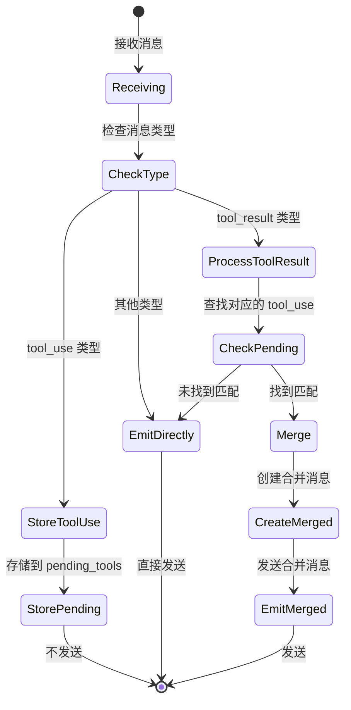

# RFC-20250124-001: 消息处理架构设计

## 1. 概述

### 1.1 背景

当前 Pivo 系统中，AI Agent（Claude、Gemini 等）的工具调用消息是分离的：
- "Using tool" 开始消息
- "Tool Result" 结束消息

这种设计导致：
- 前端需要解析原始工具输出
- 消息展示不够简洁
- 难以支持多种 AI Agent 的不同输出格式

### 1.2 目标

基于现有架构，以最小改动实现：
1. 后端合并工具开始和结束消息
2. 保持与现有系统的兼容性
3. 提供结构化的工具执行信息（如 diff）
4. 易于扩展新的工具处理逻辑

### 1.3 设计原则

- **最小化改动**：基于现有架构，只在必要处添加新功能
- **向后兼容**：保留现有消息格式和处理流程
- **渐进式迁移**：可以逐步迁移，新旧系统可以共存
- **保持简单**：不过度设计，解决实际问题

## 2. 现有架构分析

### 2.1 当前消息流

```
AI Agent → Converter → AgentOutput → ConversationMessage → Channel → Frontend
```

### 2.2 核心组件

```
/src-tauri/src/services/coding_agent_executor/
├── agent.rs           # CodingAgent trait 和 ChannelMessage 定义
├── claude_agent.rs    # Claude AI Agent 实现
├── gemini_agent.rs    # Gemini AI Agent 实现
├── message.rs         # AgentOutput 消息格式定义
├── metadata.rs        # 消息元数据定义
├── service.rs         # 核心服务实现，包含消息处理器
└── types.rs           # ConversationMessage 等类型定义
```

### 2.3 现有数据结构

```rust
// message.rs - AI Agent 输出的统一格式
pub enum AgentOutput {
    ToolUse {
        id: String,
        tool_name: String,
        tool_input: serde_json::Value,
        timestamp: DateTime<Utc>,
    },
    ToolResult {
        tool_use_id: String,
        tool_name: String,
        result: String,
        is_error: bool,
        timestamp: DateTime<Utc>,
    },
    // ... 其他变体
}

// types.rs - 前后端通信的统一格式
pub struct ConversationMessage {
    pub id: String,
    pub role: MessageRole,
    pub message_type: String,      // "tool_use", "tool_result" 等
    pub content: String,
    pub timestamp: DateTime<Utc>,
    pub metadata: Option<serde_json::Value>,
}

// agent.rs - Channel 消息
pub struct ChannelMessage {
    pub attempt_id: String,
    pub task_id: String,
    pub message: ConversationMessage,
}
```

## 3. 架构设计

### 3.1 核心思路

在现有的 `start_message_processor` 函数中添加消息合并逻辑，不改变其他组件。

### 3.2 改动位置

主要改动集中在 `service.rs` 的消息处理器中：

```
┌─────────────┐     ┌──────────────┐     ┌─────────────────┐     ┌──────────────┐
│   AI Agent  │────>│  Converter   │────>│ Message Channel │────>│   Frontend   │
└─────────────┘     └──────────────┘     └─────────────────┘     └──────────────┘
                                                   │
                                                   ▼
                                          ┌─────────────────┐
                                          │Message Processor│ ← 在这里添加合并逻辑
                                          │ (合并工具消息)  │
                                          └─────────────────┘
```

### 3.3 消息合并流程



## 4. 实现方案

### 4.1 修改消息处理器

```rust
// service.rs
fn start_message_processor(
    receiver: Receiver<ChannelMessage>,
    app_handle: AppHandle,
    // ... 其他参数
) {
    // 新增：待处理的工具消息
    let mut pending_tools: HashMap<String, PendingToolExecution> = HashMap::new();
    
    // 新增：配置
    let merge_tool_messages = true; // 可以从配置读取
    
    while let Ok(agent_msg) = receiver.recv() {
        let conversation_msg = agent_msg.message;
        
        // 新增：消息合并逻辑
        let should_emit = if merge_tool_messages {
            process_message_with_merge(&mut pending_tools, &conversation_msg)
        } else {
            true // 不合并，直接发送
        };
        
        if should_emit {
            // 保存到内存和数据库
            let _ = messages.lock().unwrap().push(conversation_msg.clone());
            if let Err(e) = state.db.save_agent_message(...) {
                log::error!("Failed to save message: {}", e);
            }
            
            // 发送到前端
            let _ = app_handle.emit("coding-agent-message", serde_json::json!({
                "task_id": task_id,
                "attempt_id": attempt_id,
                "message": conversation_msg,
            }));
        }
    }
}

// 新增：消息处理逻辑
fn process_message_with_merge(
    pending_tools: &mut HashMap<String, PendingToolExecution>,
    message: &ConversationMessage,
) -> bool {
    match message.message_type.as_str() {
        "tool_use" => {
            if let Some(tool_use_id) = extract_tool_use_id(message) {
                pending_tools.insert(tool_use_id, PendingToolExecution {
                    message: message.clone(),
                    timestamp: Utc::now(),
                });
                false // 暂不发送
            } else {
                true // 无法提取 ID，直接发送
            }
        }
        "tool_result" => {
            if let Some(tool_use_id) = extract_tool_result_id(message) {
                if let Some(pending) = pending_tools.remove(&tool_use_id) {
                    // 创建合并消息并发送
                    let merged = create_merged_tool_message(&pending.message, message);
                    emit_merged_message(app_handle, merged);
                    false // 已处理
                } else {
                    true // 找不到对应的开始，直接发送
                }
            } else {
                true
            }
        }
        _ => true // 其他消息直接发送
    }
}
```

### 4.2 新增数据结构

```rust
// 在 types.rs 中添加
#[derive(Clone)]
struct PendingToolExecution {
    message: ConversationMessage,
    timestamp: DateTime<Utc>,
}

// 工具执行元数据
#[derive(Clone, Serialize, Deserialize, Debug)]
pub struct ToolExecutionMetadata {
    pub tool_name: String,
    pub tool_use_id: String,
    pub input: serde_json::Value,
    pub output: String,
    pub is_error: bool,
    pub duration_ms: u64,
    pub summary: String,
    pub details: Option<ToolDetails>,
}

// 工具详情
#[derive(Clone, Serialize, Deserialize, Debug)]
#[serde(tag = "type", content = "data")]
pub enum ToolDetails {
    Diff { 
        old_content: String,
        new_content: String,
        file_path: String,
    },
    FileList(Vec<String>),
    CommandOutput { 
        stdout: String,
        stderr: String,
        exit_code: i32,
    },
}
```

### 4.3 工具 ID 提取函数

```rust
// 提取工具使用 ID
fn extract_tool_use_id(message: &ConversationMessage) -> Option<String> {
    if message.message_type == "tool_use" {
        message.metadata
            .as_ref()
            .and_then(|m| m.get("tool_use_id"))
            .and_then(|id| id.as_str())
            .map(|s| s.to_string())
    } else {
        None
    }
}

// 提取工具结果 ID
fn extract_tool_result_id(message: &ConversationMessage) -> Option<String> {
    if message.message_type == "tool_result" {
        message.metadata
            .as_ref()
            .and_then(|m| m.get("tool_use_id"))
            .and_then(|id| id.as_str())
            .map(|s| s.to_string())
    } else {
        None
    }
}
```

### 4.4 消息合并函数

```rust
fn create_merged_tool_message(
    tool_use: &ConversationMessage,
    tool_result: &ConversationMessage,
) -> ConversationMessage {
    let tool_name = extract_tool_name(tool_use);
    let duration_ms = tool_result.timestamp
        .signed_duration_since(tool_use.timestamp)
        .num_milliseconds() as u64;
    
    // 创建简洁的摘要
    let summary = create_tool_summary(&tool_name, tool_use, tool_result);
    
    // 创建合并后的元数据
    let metadata = ToolExecutionMetadata {
        tool_name: tool_name.clone(),
        tool_use_id: extract_tool_use_id(tool_use).unwrap_or_default(),
        input: tool_use.metadata
            .as_ref()
            .and_then(|m| m.get("structured"))
            .cloned()
            .unwrap_or(serde_json::Value::Null),
        output: tool_result.content.clone(),
        is_error: tool_result.metadata
            .as_ref()
            .and_then(|m| m.get("error"))
            .and_then(|e| e.as_bool())
            .unwrap_or(false),
        duration_ms,
        summary: summary.clone(),
        details: create_tool_details(&tool_name, tool_use, tool_result),
    };
    
    ConversationMessage {
        id: format!("{}-merged", tool_use.id),
        role: MessageRole::Assistant,
        message_type: "tool_execution".to_string(),
        content: summary,
        timestamp: tool_use.timestamp,
        metadata: Some(serde_json::to_value(metadata).unwrap()),
    }
}

// 创建工具摘要
fn create_tool_summary(
    tool_name: &str,
    tool_use: &ConversationMessage,
    tool_result: &ConversationMessage,
) -> String {
    match tool_name {
        "Edit" => {
            if let Some(file_path) = extract_file_path(tool_use) {
                format!("Updated {}", file_path)
            } else {
                "Updated file".to_string()
            }
        }
        "Write" => {
            if let Some(file_path) = extract_file_path(tool_use) {
                format!("Created {}", file_path)
            } else {
                "Created file".to_string()
            }
        }
        "Read" => {
            if let Some(file_path) = extract_file_path(tool_use) {
                format!("Read {}", file_path)
            } else {
                "Read file".to_string()
            }
        }
        _ => format!("{} completed", tool_name),
    }
}
```

### 4.5 可选的工具处理器扩展

如果需要更复杂的处理逻辑（如计算 diff），可以创建工具处理器：

```rust
// tool_processors/mod.rs
pub trait ToolProcessor: Send + Sync {
    fn tool_name(&self) -> &'static str;
    fn create_details(
        &self,
        tool_use: &ConversationMessage,
        tool_result: &ConversationMessage,
    ) -> Option<ToolDetails>;
}

// tool_processors/edit_processor.rs
pub struct EditProcessor;

impl ToolProcessor for EditProcessor {
    fn tool_name(&self) -> &'static str {
        "Edit"
    }
    
    fn create_details(
        &self,
        tool_use: &ConversationMessage,
        tool_result: &ConversationMessage,
    ) -> Option<ToolDetails> {
        // 从 tool_use 提取 old_string 和 new_string
        // 返回 Diff 详情
        // 这是可选的增强功能
        None
    }
}
```

## 5. 前端适配

### 5.1 新增消息类型

```typescript
// 新增工具执行消息类型
export interface ToolExecutionMessage extends BaseMessage {
  role: 'assistant';
  messageType: 'tool_execution';
  metadata: {
    toolName: string;
    toolUseId: string;
    input: any;
    output: string;
    isError: boolean;
    duration: number;
    summary: string;
    details?: ToolDetails;
  };
}

export type ToolDetails = 
  | { type: 'diff'; data: { oldContent: string; newContent: string; filePath: string } }
  | { type: 'fileList'; data: string[] }
  | { type: 'commandOutput'; data: { stdout: string; stderr: string; exitCode: number } };
```

### 5.2 消息渲染器更新

```typescript
// MessageRenderer.tsx
function MessageRenderer({ message }: { message: ConversationMessage }) {
  switch (message.messageType) {
    case 'tool_execution':
      return <ToolExecutionMessage message={message} />;
    case 'tool_use':
      // 向后兼容：如果收到未合并的消息
      return <ToolUseMessage message={message} />;
    case 'tool_result':
      // 向后兼容：如果收到未合并的消息
      return <ToolResultMessage message={message} />;
    // ... 其他类型
  }
}
```

## 6. 实施计划

### 6.1 第一阶段：基础实现
1. 在 `service.rs` 中添加消息合并逻辑
2. 添加必要的辅助函数
3. 通过配置开关控制是否启用

### 6.2 第二阶段：前端支持
1. 添加新的消息类型定义
2. 创建 `ToolExecutionMessage` 组件
3. 保留对旧消息格式的支持

### 6.3 第三阶段：增强功能
1. 添加工具处理器机制（可选）
2. 实现 diff 计算等高级功能
3. 优化消息展示

## 7. 优势

1. **最小改动**：只在消息处理器中添加逻辑，不影响其他组件
2. **向后兼容**：可以通过配置开关控制，新旧系统可以共存
3. **渐进式迁移**：前端可以同时支持新旧消息格式
4. **易于扩展**：可以逐步添加更多工具的特殊处理逻辑
5. **保持简单**：不改变现有的架构和数据流

## 8. 风险与缓解

### 8.1 消息顺序问题
- 风险：工具结果可能先于工具使用到达
- 缓解：保留未匹配的结果消息直接发送

### 8.2 内存泄漏
- 风险：未匹配的工具使用消息一直保存在内存中
- 缓解：定期清理超时的待处理消息

### 8.3 兼容性问题
- 风险：前端可能不支持新的消息格式
- 缓解：通过配置开关控制，保留对旧格式的支持

## 9. 总结

这个方案基于现有架构，以最小的改动实现了工具消息的合并功能。通过在消息处理器中添加合并逻辑，我们可以：

1. 提供更好的用户体验（合并的工具消息）
2. 保持系统的简单性和可维护性
3. 支持渐进式迁移和向后兼容
4. 为未来的增强功能预留扩展点

整个方案专注于解决实际问题，避免过度设计，符合 Pivo 项目的实际需求。